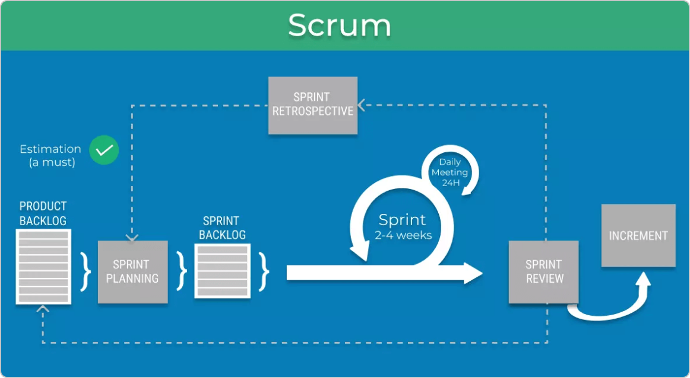

# Task Estimation in Scrum

## Summary

In this section we will explore the real-world challenges and tips around estimating work in Scrum. We'll highlight common drawbacks developers experience and offer practical advice based on real developer insights — not just theory. Task estimation can be difficult and is often not followed correctly. Developers may be asked to predict time frames on their work, this does not work in real world practice. Unpredictable events, priority changes and tasks with deeper complexities can all cause drawbacks and delay the original length of time predicted. If we don't follow best practice this can lead to a whole host of problems, work is not done efficiently in the eyes of the stakeholders or is rushed and not complete with the needed quality.

Researching real developers 	experiences, a few key points emerge. When we are estimating time frames, we need to change the narrative between right and wrong to more of a shared understanding. Teams should use historical data from past projects, involve everyone on the team and have discussions about risk and complexity. Teams should avoid making rushed decisions based on guesswork or pressure. The goal is to improve how well we predict these time frames using reflection, collaboration, and practice.

---

## Good Practices 

- **Use story points instead of time-based estimates.**  
  This avoids the pressure of committing to exact times and allows for comparisons between tasks. 

- **Estimate as a group, not alone.**  
  Not all developers have the same perspectives. Group discussions can help reveal hidden complexities within the task and improve accuracy.

- **Be honest about uncertainty and allow for a buffer.**  
  Estimations should account for testing, debugging, and the unknown — not just coding time.

- **Break down large tasks before estimating.**  
  Estimating “Build login system” is harder than estimating smaller pieces like “design UI” or “set up auth routes.”

- **Review your estimates after each sprint.**  
  Compare what you predicted with what actually happened — and learn from the differences. Learing from past mistakes is the only way to prevent them in the future.

- **Leave a small buffer for the unknown.**  
  Allow space in the sprint for things like testing, bug fixing, or unexpected blockers.

---

## Bad Practices 

- **Rushing through or skipping estimation.**  
  When teams skip sprint planning or backlog refinement, they go into the sprint blind.

- **Letting one person do all the estimating.**  
  This creates blind spots, bottlenecks, and over-reliance on a single person’s judgement. Estimations should be discussed in teams. 

- **Making estimates under pressure.**  
  Saying “it’ll only take a day” to make stakeholders happy leads to burnout and broken trust. You must be honest with your team for everyones best interests.

- **Not updating estimates when things change.**  
  If priorities or task scope change, estimates should be reviewed — not ignored. Do not be afriad to go back and change the estimation espically if the original is now 
  close to impossible

- **Treating estimates like fixed commitments.**  
  Estimations are meant to guide, not punish. Over-promising leads to rushed or poor-quality work.

---

*Figure 1: Scrum Workflow Diagram. Source: [Agile Workflow: Your Go-To Guide to an Adaptive Process](https://businessmap.io/agile/project-management/workflow)*

---

## Articles / References

1. [Story Point Estimation: What I Wish I Knew – Atlassian Blog](https://www.atlassian.com/agile/project-management/estimation)  
   A practical guide from Atlassian on using story points effectively, including common team misunderstandings and how to improve relative estimation over time.

2. [Why I Stopped Using Planning Poker – Medium (AgileLab)](https://medium.com/agilelab/why-i-stopped-using-planning-poker-f6e7f1e6dbda)  
   A blog post from an Agile practitioner explaining why Planning Poker didn’t work for their team. They talk about issues like forced consensus, wasted time, and 
   the importance of team maturity and trust in estimation practices.

3. [A Case Study on Agile Estimating and Planning using Scrum – Mahnič (2011)](https://www.eejournal.ktu.lt/index.php/elt/article/view/372)  
   A research study on a student Scrum team’s real-world estimation experience. Highlights estimation improvement across Sprints and factors that influenced their accuracy.

4. [Scrum – From Hype to Disappointment? (Westman, 2023)](https://www.diva-portal.org/smash/record.jsf?pid=diva2%3A1766066)  
   A Bachelor's thesis exploring what Scrum practices are most often skipped in the real world and why. Based on a survey of 106 professionals, it shows the issues around 
   Sprint Planning, estimation accuracy, and how skipping Scrum events impacts developer stress and 
   project quality.

5. [The Problem With Agile Estimation – Easy Agile Blog](https://www.easyagile.com/blog/problem-with-agile-estimation)  
   A blog post discussing the recurring pain points teams face with Agile estimation, such as treating estimates as commitments, not revisiting assumptions, and failing to 
   learn from past mistakes. Offers advice on how to break the cycle and improve.
   

